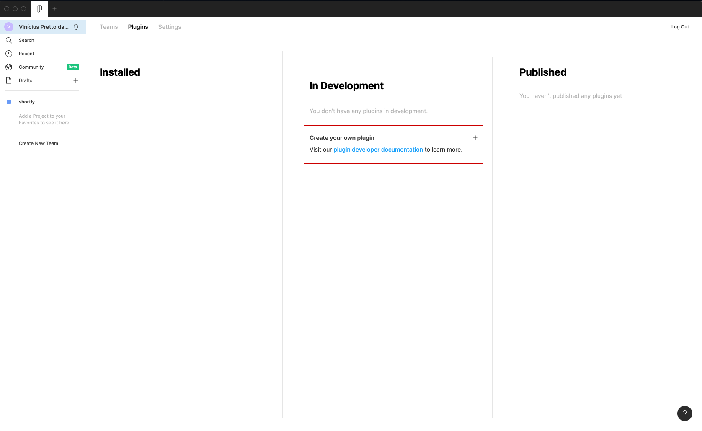
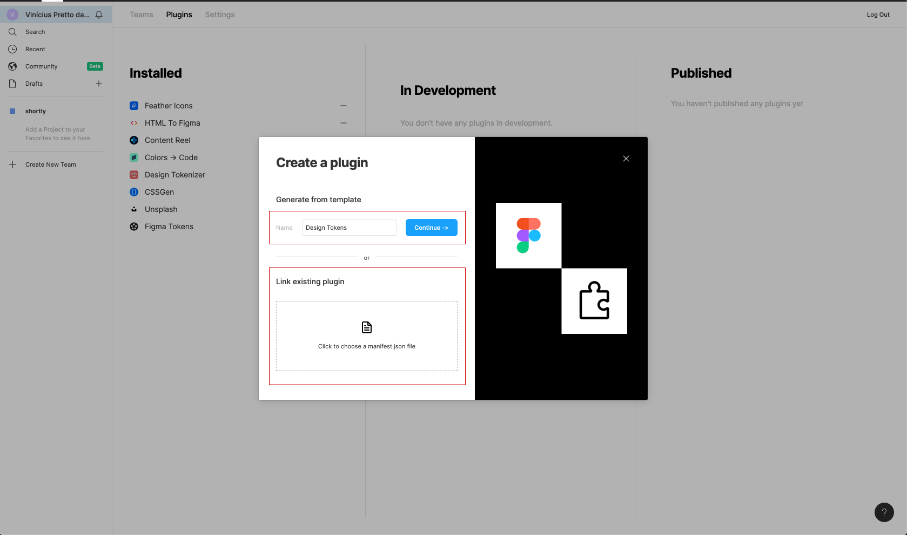
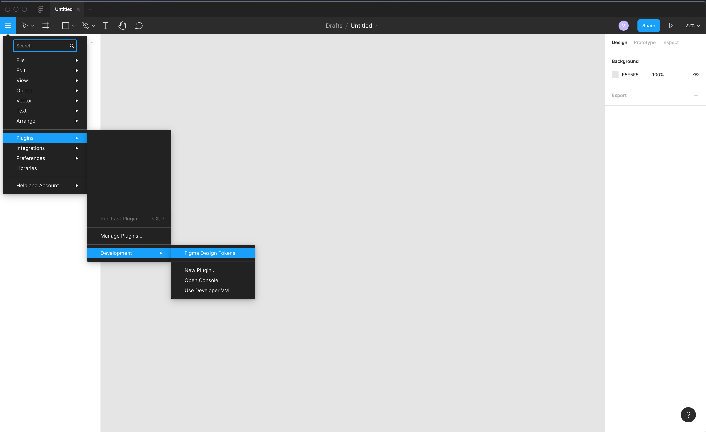

# Figma Design Tokens plugin

The goal of this project is to give ability to create and export tokens on Figma.

### Running on development environment

**Requirements:**

- OS System (macOS or Windows)
- Node.js >= v10.22
- NPM >= v6.14.6

**1. Install dependencies**

```
$ npm install
```

**2. Build application**

```
$ npm run build
```

**3. Install Figma Desktop**

- [Figma downloads](https://www.figma.com/downloads/)

**4. Add plugin on Figma**

Go to manage plugins and click on "Create your own plugin"



Choose a name for this plugin and upload the manifest.json



Now you can run this plugin.


